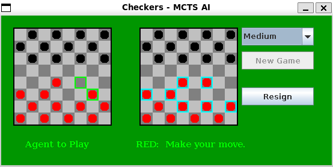

# Monte Carlo Tree Search for Checkers

An intelligent AI opponent for Checkers that learns winning strategies through simulation rather than brute force search.



---

## Table of Contents
1. [What is Monte Carlo Tree Search?](#what-is-monte-carlo-tree-search)
2. [Why Not Use Minimax?](#why-not-use-minimax)
3. [The Four Pillars of MCTS](#the-four-pillars-of-mcts)
4. [How to Run the Game](#how-to-run-the-game)
5. [How to Play](#how-to-play)

---

## What is Monte Carlo Tree Search?

Monte Carlo Tree Search (MCTS) is a smart way to make decisions in games. Instead of trying to look at every possible move (which is impossible for complex games), MCTS:

1. **Focuses on promising moves** - Spends more time exploring moves that look good
2. **Learns from experience** - Plays thousands of random games to see what works
3. **Gets better with time** - The more it thinks, the better its moves become

**Think of it like this:** Rather than memorizing every chess opening, you play lots of practice games and learn which positions tend to win.

---

## Why Not Use Minimax?

Traditional game AI uses an algorithm called **Minimax**. It sounds good in theory, but has some serious problems for games like Checkers.

### The Minimax Idea

Minimax tries to look ahead and assume both players play perfectly:
- **You** try to maximize your score (MAX player)
- **Your opponent** tries to minimize your score (MIN player)
- The algorithm calculates the "best guaranteed outcome"

### The Problems

#### Problem 1: The Explosion of Possibilities

Let's say Checkers has about 10 legal moves per turn on average. If we want to look ahead:

- **4 moves ahead:** $10^4 = 10,000$ positions to check
- **6 moves ahead:** $10^6 = 1,000,000$ positions
- **8 moves ahead:** $10^8 = 100,000,000$ positions
- **Complete game:** About $10^{20}$ positions *(impossible!)*

Even with clever shortcuts (Alpha-Beta pruning), we can only search **6-8 moves deep**. Many important tactics happen deeper than that!

#### Problem 2: The Heuristic Nightmare

Since we can't search the entire game, Minimax needs a **heuristic function** - a formula that guesses how good a position is:

$$\text{Score} = 3 \times (\text{pieces}) + 5 \times (\text{kings}) + 0.5 \times (\text{mobility}) + \ldots$$

**The trouble is:**
- How do we know the right weights? (3 for pieces, 5 for kings, etc.)
- What features should we include?
- Different positions need different evaluations
- We need expert knowledge to design a good formula

If your heuristic is wrong, **your AI plays badly** - garbage in, garbage out!

#### Problem 3: The Horizon Effect

Minimax searches to a fixed depth and stops. But what if something important happens just beyond that depth?

```
Move 5: Everything looks fine
Move 6: (Search stops here - position looks safe)
Move 7: Opponent threatens your piece! (We never saw this!)
Move 8: You lose a piece trying to defend
```

This is called the **horizon effect** - critical tactics happening just beyond where you can see.

#### Problem 4: Perfect Play Assumption

Minimax assumes your opponent never makes mistakes. But:
- Real opponents **do** make mistakes
- Some moves **create complexity** to confuse opponents
- Traps and sacrifices can work against humans

Minimax can't set traps or adapt to opponent skill - it always assumes perfection.

---

## The Four Pillars of MCTS

MCTS solves these problems with four simple steps, repeated over and over:

```
┌─────────────────────────────────────┐
│  Repeat 50 times (or 150 for Hard) │
└─────────────────────────────────────┘
        │
        ↓
   1. SELECTION
   2. EXPANSION  
   3. SIMULATION
   4. BACKPROPAGATION
        │
        ↓
   Choose best move
```

Let's understand each pillar:

---

### Pillar 1: SELECTION - Navigate to Promising Areas

**What it does:** Walks through the tree of moves you've explored before, choosing the most promising path.

**How it chooses:** Uses the **UCT formula** to balance two things:

$$\text{UCT} = \underbrace{\frac{\text{wins}}{\text{visits}}}_{\text{Exploitation}} + \underbrace{c \times \sqrt{\frac{\ln(\text{parent visits})}{\text{visits}}}}_{\text{Exploration}}$$

- **Exploitation part:** Choose moves that have won before
- **Exploration part:** Also try moves we haven't explored much
- **$c$:** Controls how adventurous we are (Easy: 1.4, Medium: 2.2, Hard: 3.0)

**Example:**
```
Move A: 15 wins out of 20 tries (75% win rate, well explored)
Move B: 3 wins out of 4 tries (75% win rate, barely explored)

UCT gives Move B a bonus for being unexplored!
→ Might pick B to learn more about it
```

**In plain English:** Follow the path that's either **winning a lot** or **hasn't been tried much yet**.

---

### Pillar 2: EXPANSION - Add One New Possibility

**What it does:** When you reach the edge of what you've explored, add ONE new move to investigate.

**Why only one?** This is clever:
- Good moves get expanded more (they're visited more often)
- Bad moves might never get fully expanded (saves time!)
- The tree grows naturally toward winning strategies

**Example:**
```
Iteration 5: Reach Move A → Add Response X
Iteration 8: Reach Move A again → Add Response Y  
Iteration 12: Reach Move B → Add Response Z
Iteration 15: Back to Move A → Add Response W

See? Move A getting explored more because it's promising!
```

**In plain English:** Each time you think, explore ONE new possibility. Good paths naturally get explored deeper.

---

### Pillar 3: SIMULATION - Play It Out

**What it does:** From the new move you just added, play a complete random game and see who wins.

**The process:**
1. Make random moves for both players
2. Continue until someone wins OR 20 moves pass
3. Score the result:
   - AI wins: **1.0** points
   - Tie or unclear: **0.5** points  
   - AI loses: **0.0** points

**Wait, random moves? How does that help?**

Great question! Here's the magic:

- Good positions win more random games than bad positions
- After many simulations, the **win rate** tells us which moves are better
- We don't need expert knowledge - just play games and count wins!

**Example:**
```
Position A: Wins 80% of random games → Excellent position!
Position B: Wins 50% of random games → Equal position
Position C: Wins 20% of random games → Bad position!

The ranking is correct even with random play!
```

**In plain English:** Play out the game randomly to see if this move leads to winning positions. Do this many times, and the statistics don't lie.

---

### Pillar 4: BACKPROPAGATION - Share What You Learned

**What it does:** Updates all the moves that led to this position with the simulation result.

**The update:**
```
For each move from root to the new position:
   - Increase visit count by 1
   - Add the reward (0.0, 0.5, or 1.0)
```

**Why update all ancestors?** Because the simulation result tells us about **every decision** that led there.

**Example:**
```
Game path: Root → Move A → Response X → Move B → New position
Simulation: AI wins! (1.0 reward)

Updates:
Root:       visits 49→50,  total wins 25→26  (52% win rate)
Move A:     visits 24→25,  total wins 15→16  (64% win rate)
Response X: visits 11→12,  total wins  8→9   (75% win rate)
Move B:     visits  6→7,   total wins  5→6   (86% win rate)
New position: visits 0→1,  total wins  0→1   (100% win rate)

Notice: Win rate increases as we go deeper = following the best path!
```

**In plain English:** Tell all the moves in this sequence "Hey, this path led to a win!" so they get tried more often next time.

---

### Putting It All Together

After 50 iterations (Medium difficulty):

```
Root (50 visits)
├── Move A (25 visits, 18 wins) ← 72% win rate, heavily explored
│   ├── Response X (12 visits) → went 6 levels deep
│   └── Response Y (8 visits) → went 4 levels deep
├── Move B (15 visits, 6 wins) ← 40% win rate, moderately explored  
├── Move C (8 visits, 3 wins) ← 38% win rate, lightly explored
└── Move D (2 visits, 0 wins) ← 0% win rate, almost ignored

Decision: Choose Move A (most visits = most reliable)
```

**Key insight:** We choose the move with the **most visits**, not the highest win rate. Why? Because more visits = more reliable statistics. A move with 20 visits and 60% win rate is more trustworthy than one with 2 visits and 100% win rate.

---

## How to Run the Game

### Prerequisites
- Java JDK 8 or higher

### Step 1: Compile the Code

Open your terminal and navigate to the project folder:

```bash
cd "Monte_Carlo Tree search/Kunle_Oguntoye_proj2"
javac edu/iastate/cs572/proj2/*.java
```

### Step 2: Run the Game

```bash
java edu.iastate.cs572.proj2.Checkers
```

A window will appear with the checkers board!

### Step 3: Choose Difficulty

Use the dropdown menu at the top to select difficulty:

| Difficulty | Iterations | Thinking Time | How Strong? |
|-----------|-----------|---------------|-------------|
| **Easy** | 20 | ~0.5 seconds | Beatable for beginners |
| **Medium** | 50 | ~1-2 seconds | Good challenge |
| **Hard** | 150 | ~3-5 seconds | Very difficult to beat |

**What do iterations mean?**
- Easy (20 iterations): AI thinks through 20 simulation cycles
- Medium (50 iterations): 50 cycles = smarter decisions  
- Hard (150 iterations): 150 cycles = very strategic play

More iterations = deeper understanding = harder opponent!

---

## How to Play

### Game Setup

When you launch the game, you'll see:
- **Red pieces** (bottom rows): You control these
- **Black pieces** (top rows): The AI controls these
- **Difficulty dropdown**: At the top of the window

### Basic Checkers Rules

**Movement:**
- Regular pieces move diagonally forward one square
- Kings (marked with 'K') can move diagonally forward OR backward

**Capturing (Jumping):**
- Jump over opponent pieces diagonally to capture them
- Can chain multiple jumps in one turn
- **Mandatory jumps:** If you can jump, you MUST jump!

**Winning:**
- Capture all opponent pieces, OR
- Trap opponent so they have no legal moves

**Becoming a King:**
- When your piece reaches the opposite end of the board, it becomes a king

---

### Playing a Turn

**Your Turn (Red):**

1. **Click on one of your red pieces**
   - Valid moves will be highlighted
   - Only pieces with legal moves can be selected

2. **Click on the destination square**
   - Your piece moves there
   - If it's a jump, opponent's piece is captured
   - If you can continue jumping, you must do so

3. **AI's turn starts automatically**

**AI's Turn (Black):**

1. **The AI thinks** (you'll see a brief pause)
   - Running MCTS algorithm
   - Playing simulations in the background
   - Building its decision tree

2. **Black piece moves automatically**
   - You'll see which piece moved
   - The AI generally makes smart moves!

3. **Back to your turn**

---

### Strategy Tips

**Playing Against MCTS:**

✅ **Do:**
- Control the center - more mobility = more options
- Get kings early - they're much more powerful
- Force trades when you're ahead - simplify the position
- Think several moves ahead
- Protect your back row to prevent early kings

❌ **Don't:**
- Leave pieces undefended - MCTS will punish you!
- Make random moves - the AI learns from patterns
- Rush forward without a plan
- Forget mandatory jumps (the game won't let you anyway)

**What the AI does well:**
- Finds tactical captures and multi-jump sequences
- Avoids obvious blunders
- Trades pieces when ahead
- Maintains material advantage

**What the AI struggles with:**
- Very long-term strategic positioning (beyond simulation depth)
- Subtle traps that require 15+ move sequences
- Opening theory (first few moves are somewhat random)

---

### Understanding AI Behavior

**Why does the AI pause before moving?**
- It's running 20, 50, or 150 simulation cycles (depending on difficulty)
- Each cycle: Selection → Expansion → Simulation → Backpropagation
- More cycles = smarter move, but takes longer

**Does the AI get smarter as the game goes on?**
- Yes! Fewer pieces = smaller game tree = deeper search
- Endgame positions are easier to evaluate accurately
- The AI is strongest in the endgame

**Can I make the AI even harder?**

Yes! You can modify the code:

```java
// In MonteCarloTreeSearch.java, add a new difficulty:
EXPERT(500, 4.0);  // Very challenging!

// Trade-off: Takes 10-15 seconds per move
```

---

## Project Structure

```
Kunle_Oguntoye_proj2/
├── edu/iastate/cs572/proj2/
│   ├── MonteCarloTreeSearch.java   # Main MCTS algorithm
│   ├── MCNode.java                 # Tree node with UCT calculation
│   ├── Checkers.java               # GUI and game controller
│   ├── CheckersData.java           # Game state and rules
│   ├── CheckersMove.java           # Move representation
│   ├── CHECKERS.png                # Game screenshot
│   └── ...
├── README.md                       # Original documentation
└── README2.md                      # This file
```

---

## Key Concepts Summary

### MCTS vs Minimax

| Feature | Minimax | MCTS |
|---------|---------|------|
| **Search Strategy** | Breadth-first to fixed depth | Focused on promising paths |
| **Evaluation** | Needs heuristic function | Uses random playouts |
| **Depth** | Fixed (6-8 moves) | Variable (focuses deeper where it matters) |
| **Expert Knowledge** | Required (design heuristic) | Not needed (learns from games) |
| **Handles Complexity** | Struggles with high branching | Handles naturally |
| **Adaptivity** | Fixed strategy | Improves with more iterations |

### The Four Pillars Recap

1. **Selection:** Navigate tree using UCT (balance exploration/exploitation)
2. **Expansion:** Add one new move possibility
3. **Simulation:** Play random game to estimate value
4. **Backpropagation:** Update all moves on path with result

### Why It Works

- **Law of Large Numbers:** Many random games → reliable statistics
- **UCT Formula:** Automatically balances trying new moves vs exploiting good ones
- **Incremental Growth:** Tree grows toward winning strategies naturally
- **No Heuristic:** Game outcomes speak for themselves

---

## Author

**Kunle Oguntoye**  
Implementation of Monte Carlo Tree Search for Checkers

---

## References

- Browne, C., et al. (2012). "A Survey of Monte Carlo Tree Search Methods"
- Kocsis, L. & Szepesvári, C. (2006). "Bandit based Monte-Carlo Planning"
- Silver, D., et al. (2016). "Mastering the game of Go with deep neural networks and tree search" (AlphaGo)

---

*"The best way to predict the future is to simulate it many times and see what happens most often."* - MCTS Philosophy
